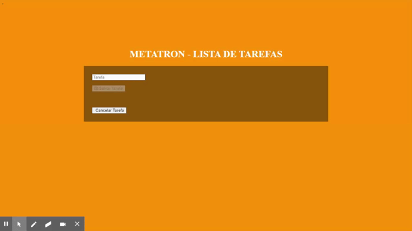

Repositório destinado ao processo seletivo da Metatron.
<h2>Entrega: 07/10/2020<h2>

<h3>Como desenvolvi a lista de tarefas ?<h3>
<h4>Primeiramente criei o repositório para fazer o controle de versão do projeto, após isso fiz a instalação do Angular através do gerenciador de pacotes do node (npm) e me certifiquei de pesquisar sobre os métodos de inserção e exclusão de itens da lista. Eu diria que a única dificuldade foi criar os métodos em apenas um dia.</h4>
  

</
